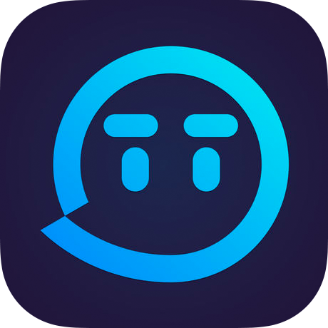

  <a href="README.md">[English Version]</a>
  ｜
  <a href="README_ZH.md">[中文版]</a>

  <picture>
    <source srcset="assets/images/MiniMaxLogo-Dark.png" media="(prefers-color-scheme: dark)">
      
    </source>
  </picture>
  <h1 style="text-align: center;">Awesome MiniMax Integrations</h1>
  
Explore these applications integrating MiniMax's multimodal API to see how text, vision, and speech processing capabilities are incorporated into various software. Head to the <a href="https://www.minimax.io/platform" target="_blank">MiniMax Open Platform</a> to get your API key

# Table of Contents

- [⏱ Productivity](#productivity)
- [🔬 Education](#education)
- [📖 Reading](#reading)
- [💻 Developer Tools](#developer-tools)
- [🎨 Creative Tools](#creative-tools)
- [🎧 Media](#media)
- [🤹 Character](#character)

# Productivity

<table>
<tr>
<th>Logo</th>
<th>Product</th>
<th>Description</th>
</tr>
<tr>
<td></td>
<td><a href="https://personal-act.wps.cn/application/spa/wpsai">WPS AI</a></td>
<td>WPS AI is a generative artificial intelligence application that enhances document processing capabilities within the WPS Office suite. It integrates large language model technology to assist users with content creation, editing, and optimization. As one of the pioneering ChatGPT-like applications in the Chinese collaborative office market, WPS AI helps streamline workflows through intelligent text generation, data analysis, and formatting suggestions.</td>
</tr>
<tr>
<td></td>
<td><a href="https://www.n.cn/">N</a></td>
<td>N is a multimodal search engine that supports diverse input methods including text, voice, photo, and video queries. Developed by the 360 Group and officially launched in November 2024, this search platform accepts various input formats to help users find information more effectively. Unlike AI models that generate content, N focuses specifically on enhancing search capabilities through multiple input modalities, creating a more intuitive and versatile search experience.</td>
</tr>
<tr>
<td></td>
<td><a href="https://www.dingtalk.com/">DingTalk</a></td>
<td>DingTalk is an intelligent enterprise collaboration platform designed for the AI era, serving millions of organizations globally. The system integrates communication tools, workflow automation, and application development capabilities to enable digital transformation. It supports agile organizational structures and facilitates seamless collaboration across teams through integrated messaging, document sharing, and smart productivity features.</td>
</tr>
<tr>
<td></td>
<td><a href="https://www.quark.cn/">Quark</a></td>
<td>Quark is a lightweight mobile browser featuring built-in search functionality. The application emphasizes minimalist design principles, delivering essential browsing capabilities without excessive resource consumption. Its streamlined interface and efficient performance particularly appeal to younger users seeking simplified digital experiences without sacrificing core web navigation features.</td>
</tr>
</table>

# Education

<table>
<tr>
<th>Logo</th>
<th>Product</th>
<th>Description</th>
</tr>
<tr>
<td></td>
<td><a href="https://imagiraffe.com/">Imagiraffe</a></td>
<td>Imagiraffe is an interactive application fostering parent-child bonding through creative AI technology. The platform transforms children's drawings into animated characters that can engage in conversations, create stories, and embark on adventures. This innovative tool converts simple sketches into interactive experiences, stimulating imagination and strengthening family connections.</td>
</tr>
<tr>
<td></td>
<td><a href="https://ttalkai.com/">Talk AI</a></td>
<td>Talk AI is a language practice application supporting conversations in over 60 languages. The platform utilizes natural pronunciation with adjustable speaking speeds to facilitate authentic language learning experiences. It offers multiple difficulty levels, tracks conversational proficiency, and provides real-time feedback. The system includes sample questions to help users overcome communication barriers when struggling with foreign language expression.</td>
</tr>
<tr>
<td></td>
<td><a href="https://apps.apple.com/cn/app/%E8%B1%86%E7%A5%9Eai/id6504237557">DoushenAI</a></td>
<td>DoushenAI is an educational artificial intelligence system built on precision learning and personalized empowerment principles. The platform integrates knowledge graphs with adaptive learning engines and affective computing technologies. Its flagship "AI Hyper-Realistic Multi-Teacher Live Streaming Classroom" creates immersive learning environments through multi-modal interaction, delivering intelligent solutions across K12 education subjects.</td>
</tr>
</table>

# Reading

<table>
<tr>
<th>Logo</th>
<th>Product</th>
<th>Description</th>
</tr>
<tr>
<td></td>
<td><a href="https://apps.apple.com/us/app/nooka-podcast-of-book-summary/id6739706947">Nooka</a></td>
<td>Nooka delivers book insights through a distinctive podcast format featuring dual hosts who discuss key concepts, making complex ideas accessible and memorable. It distinguishes itself as the only platform providing content in English, Spanish, and Japanese languages. The service continuously expands its library with over 100 new book summaries added weekly.</td>
</tr>
<tr>
<td></td>
<td><a href="https://www.qidian.com/">QiDian Reader</a></td>
<td>QiDian Reader is a mobile reading application featuring content from the QiDian Chinese Website. The platform offers diverse literary experiences spanning text, audiobooks, and anime adaptations. With over two decades of brand development, QiDian has pioneered more than 200 online literature genres, establishing itself as a significant incubator for original digital content and intellectual property development.</td>
</tr>
<tr>
<td></td>
<td><a href="https://book.qq.com/">QQ Reading</a></td>
<td>QQ Reading is a premier mobile reading platform in China, offering over 100,000 legally published e-books with professional electronic formatting. The service features content from leading publishing institutions including China Publishing Group and CITIC Press. Its comprehensive library spans classic literature, economics, self-improvement, and practical social sciences, establishing it as the e-reading product with highest coverage of bestselling titles.</td>
</tr>
</table>

# Developer Tools

<table>
<tr>
<th>Logo</th>
<th>Product</th>
<th>Description</th>
</tr>
<tr>
<td></td>
<td><a href="https://fal.ai/">Fal.ai</a></td>
<td>Fal.ai is a generative media platform providing developers with fast, reliable APIs for AI-powered image, video, and audio creation at scale. The service focuses on optimizing inference speeds and operational efficiency, enabling seamless integration of generative AI capabilities into applications. This infrastructure supports developers building scalable AI-enhanced products across various creative domains.</td>
</tr>
<tr>
<td></td>
<td><a href="https://302.ai/en/">302AI</a></td>
<td>302AI is an enterprise-grade, pay-as-you-go AI application platform offering comprehensive capabilities across chat, image generation, knowledge management, and media processing. The platform requires no deployment or development investments, with usage charged based on actual consumption. It enables team collaboration through separate management and usage interfaces, allowing easy distribution of applications with per-user budget controls.</td>
</tr>
<tr>
<td></td>
<td><a href="https://openrouter.ai/">OpenRouter</a></td>
<td>OpenRouter offers a unified interface for accessing a wide range of large language models (LLMs). The platform simplifies the process of finding the best models and prices for various prompts, providing developers with a centralized solution for integrating LLMs into their applications.</td>
</tr>
</table>

# Creative Tools

<table>
<tr>
<th>Logo</th>
<th>Product</th>
<th>Description</th>
</tr>
<tr>
<td></td>
<td><a href="https://www.freepik.com/">Freepik</a></td>
<td>Freepik is a comprehensive creative platform offering millions of high-quality graphic resources to global design professionals. The service provides vectors, photos, icons, templates, and videos alongside AI-powered tools for image generation, background removal, voiceovers, and video creation. These solutions enable users with varying design expertise to efficiently produce visually compelling content.</td>
</tr>
<tr>
<td></td>
<td><a href="https://www.hedra.com/">Hedra</a></td>
<td>Hedra develops foundation models specializing in digital human technology. The company's flagship products, Character-1 and Character-3, transform standard photos and audio inputs into expressive, controllable digital human videos. These technologies serve filmmakers, game developers, and content creators seeking to generate lifelike human character animations with natural emotional expressions.</td>
</tr>
<tr>
<td></td>
<td><a href="https://www.kreadoai.com/">KreadoAI</a></td>
<td>KreadoAI is an AI-powered digital avatar video generation platform that enables efficient, cost-effective content creation. The system features over 1,000 realistic digital humans with natural movements and precise lip synchronization. Users can create personalized avatars with standard cameras and access 1,600+ AI voices covering 140+ languages. The platform supports multimodal video generation from text, images, audio, and presentations, with continuous technical updates for professional-quality results.</td>
</tr>
<tr>
<td></td>
<td><a href="https://www.captions.ai/">Captions</a></td>
<td>Captions is an AI-powered creative studio for streamlined video production. The platform features automatic captioning, AI-driven editing tools, eye contact correction, and multilingual dubbing capabilities. These integrated features allow users to produce professional-quality videos efficiently, enhancing storytelling potential without requiring extensive technical expertise or expensive equipment.</td>
</tr>
<tr>
<td></td>
<td><a href="https://openart.ai/">OpenArt</a></td>
<td>OpenArt is an AI art generator that enables users to transform ideas into stunning visuals using text-to-image prompts. The platform offers a variety of tools for creating and editing AI-generated images, including features like style transfer, inpainting, and image upscaling. OpenArt caters to artists and creators looking to explore the possibilities of AI-assisted art creation.</td>
</tr>
<tr>
<td></td>
<td><a href="https://videotube.ai/">VideoTube</a></td>
<td>VideoTube is a free online AI video generator that transforms simple text or images into captivating videos. It supports adding music, voiceovers, and storytelling to bring your creative ideas to life.</td>
</tr>
<tr>
<td></td>
<td><a href="https://www.creatiai.ai/">Creati AI</a></td>
<td>Creati AI functions as an AI marketing director that analyzes millions of online data points to recreate trending video templates. Users can transform a single product image into viral marketing content through AI-powered video generation. The platform features innovative AI ambassadors capable of authentically interacting with products, enabling businesses to produce large volumes of user-generated content style videos daily.</td>
</tr>
<tr>
<td></td>
<td><a href="https://pollo.net.cn/">Pollo AI</a></td>
<td>Pollo AI is a comprehensive AI video generation platform combining powerful features with an intuitive interface. The tool supports multiple creation pathways including text-to-video, image-to-video, video-to-video, and consistent character generation. Users maintain complete creative control over clip duration, stylistic elements, aspect ratios, and camera movements while benefiting from advanced AI-driven video synthesis technology.</td>
</tr>
</table>

# Media

<table>
<tr>
<th>Logo</th>
<th>Product</th>
<th>Description</th>
</tr>
<tr>
<td></td>
<td><a href="https://www.ximalaya.com/">Himalaya</a></td>
<td>Himalaya is China's largest online audio platform, transforming how users engage with knowledge and entertainment content. The service offers diverse audio experiences including audiobooks, podcasts, premium knowledge sharing, and live streaming. Its ecosystem supports content creators and consumers through an extensive library spanning educational, informational, and entertainment categories across multiple audio formats.</td>
</tr>
<tr>
<td></td>
<td><a href="https://www.52tt.com/">TT Voice</a></td>
<td>TT Voice is a gaming-focused social platform with over 100 million young users. It offers features like team matchmaking, online karaoke, and friend expansion. As an official partner of major esports leagues such as LPL and PEL, it supports professional teams in games like Honor of Kings and League of Legends. The platform also hosts events like the "Bounty Tournament," where users can win cash prizes, and includes a "Battle Room" for efficient team collaboration.</td>
</tr>
</table>

# Character

<table>
<tr>
<th>Logo</th>
<th>Product</th>
<th>Description</th>
</tr>
<tr>
<td></td>
<td><a href="https://zhumengdao.com/">Dreamerland</a></td>
<td>Dreamerland is an AI-powered virtual character interaction platform providing immersive dialogue experiences. The service enables users to engage with lifelike digital companions through natural conversation. Users can select preferred character personalities to establish meaningful connections, creating the sensation of interacting with conscious entities from alternate dimensions through advanced artificial intelligence technology.</td>
</tr>
<tr>
<td></td>
<td><a href="https://apps.apple.com/cn/app/%E5%A3%B0%E4%BC%B4-%E8%87%AA%E5%AE%9A%E4%B9%89%E5%85%8B%E9%9A%86%E9%9F%B3%E8%89%B2-%E5%AE%9E%E6%97%B6%E8%AF%AD%E9%9F%B3%E4%BA%A4%E4%BA%92/id6743003424">SoundMate</a></td>
<td>SoundMate provides real-time voice interactions with virtual characters, creating natural and emotionally nuanced communication experiences. The platform moves beyond text-based exchanges to deliver responsive voice conversations powered by advanced AI technology. Users can engage in casual chats, share thoughts, or simply enjoy companionship through audio interaction, offering a more personal alternative to traditional AI assistants.</td>
</tr>
<tr>
<td></td>
<td><a href="https://apps.apple.com/cn/app/%E9%97%AA%E4%BB%A4-%E5%A5%B3%E7%94%9F%E9%83%BD%E7%88%B1%E7%8E%A9%E7%9A%84%E4%BA%92%E5%8A%A8%E5%89%A7%E6%83%85ai/id1501949135">Vmuse</a></td>
<td>Vmuse is an interactive content social platform popular among young users. It features serialized story theaters with high degrees of freedom, numerous branching storylines, and personalized romantic narratives where users become the protagonist. Powered by specialized AI models, it transforms traditional reading into an immersive experience with diverse genres, beautiful illustrations, and deep character interactions.</td>
</tr>
<tr>
<td></td>
<td><a href="https://www.mengniai.com/">Dreamato</a></td>
<td>Dreamato is a companionship application that enriches productivity through personalized AI characters. Users achieve goals by completing "Dream Pomodoro" sessions alongside their digital companions. This approach transforms conventional task management into an immersive experience, creating emotional connections that make productivity more engaging while providing motivational support through character interaction.</td>
</tr>
</table>
