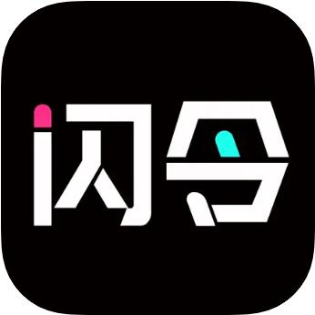

  <a href="README.md">[English Version]</a>
  ｜
  <a href="README_ZH.md">[中文版]</a>

  <picture>
    <source srcset="assets/images/MiniMaxLogo-Dark.png" media="(prefers-color-scheme: dark)">
      
    </source>
  </picture>
  <h1 style="text-align: center;">MiniMax 集成应用精选</h1>
  
探索这些集成了 MiniMax 多模态 API 的应用，了解文本、视觉和语音处理能力如何融入各种软件。访问 <a href="https://platform.minimaxi.com/" target="_blank">MiniMax 开放平台</a> 获取您的 API 密钥。

# 目录

- [⏱ 效率工具](#效率工具)
- [🔬 智能助手](#智能助手)
- [💻 开发工具](#开发工具)
- [🎨 创意工具](#创意工具)
- [📚 教育](#教育)
- [🤹 角色扮演](#角色扮演)
- [📱 社交媒体](#社交媒体)
- [📰 新闻](#新闻)
- [📖 阅读](#阅读)
- [📚 漫画](#漫画)
- [✨ 美颜编辑](#美颜编辑)
- [🔧 智能硬件](#智能硬件)
- [🚗 车载娱乐系统](#车载娱乐系统)

# 效率工具

<table>
<tr>
<th>图标</th>
<th>产品</th>
<th>描述</th>
</tr>
<tr>
<td></td>
<td><a href="https://www.alipay.com/">支付宝</a></td>
<td>支付宝是中国主流的支付与数字服务平台。该平台支持中国用户进行全球交易，并允许外国游客绑定信用卡，实现在中国境内的广泛适用。支付宝整合了安全、多样的功能，以便捷高效的方式简化用户的金融交易和日常生活服务流程。</td>
</tr>
<tr>
<td></td>
<td><a href="https://personal-act.wps.cn/application/spa/wpsai">WPS AI</a></td>
<td>WPS AI 是一款生成式人工智能应用，增强了 WPS Office 套件中的文档处理能力。它集成了大语言模型技术，帮助用户进行内容创作、编辑和优化。作为中国协同办公市场中首批类似 ChatGPT 的应用之一，WPS AI 通过智能文本生成、数据分析和格式建议来简化工作流程。</td>
</tr>
<tr>
<td></td>
<td><a href="https://www.dingtalk.com/">钉钉</a></td>
<td>钉钉是一个为 AI 时代设计的智能企业协作平台，为全球数百万组织提供服务。该系统集成了通信工具、工作流自动化和应用开发能力，以实现数字化转型。它支持灵活的组织结构，通过集成的消息传递、文档共享和智能生产力功能促进团队之间的无缝协作。</td>
</tr>
<tr>
<td></td>
<td><a href="https://www.quark.cn/">夸克</a></td>
<td>夸克是一款轻量级移动浏览器，内置搜索功能。该应用强调极简设计原则，提供基本的浏览功能而不消耗过多资源。其精简的界面和高效的性能特别吸引寻求简化数字体验而不牺牲核心网络导航功能的年轻用户。</td>
</tr>
<tr>
<td></td>
<td><a href="https://www.cainiao.com/technology-cainiao-app.html">菜鸟</a></td>
<td>菜鸟是一款综合物流应用，提供全面的包裹管理服务。它支持跟踪、极速取件以及便捷的寄件服务，覆盖超过140家国内外快递公司。菜鸟平台与各大电商平台无缝对接，简化包裹处理流程，为用户带来便利体验。</td>
</tr>
<tr>
<td></td>
<td><a href="https://miaoboai.com/">秒播</a></td>
<td>秒播能够根据用户的观看历史、喜爱的内容类型以及社交互动记录，智能推荐其可能感兴趣的短视频。这一功能让用户在观看过程中更容易发现新内容，提升了整体观看体验。同时，推荐系统也为创作者提供了更精准的目标观众触达，使他们的内容能更好地送达目标受众。</td>
</tr>
<tr>
<td></td>
<td><a href="https://www.uc.cn/">UC浏览器</a></td>
<td>UC浏览器是一款功能全面的知名移动浏览器。它不仅提供海量头条新闻、实时热搜，还拥有丰富的视频和小说资源库。该浏览器还配备了极速云盘，实现无缝的内容管理，并提供智能搜索功能，全方位提升用户的数字体验。</td>
</tr>
<tr>
<td></td>
<td><a href="https://peiyinbangshou.com/H4Home">配音帮手</a></td>
<td>配音帮手是一个旨在帮助用户创作各种高质量配音和旁白的创新平台。无论您是在制作视频、动画、广告还是任何多媒体项目，配音帮手都能提供专业级的工具和服务，让您的内容更加生动鲜活。</td>
</tr>
</table>

# 智能助手

<table>
<tr>
<th>图标</th>
<th>产品</th>
<th>描述</th>
</tr>
<tr>
<td></td>
<td><a href="https://xiaoai.mi.com/">超级小爱</a></td>
<td>超级小爱是小米于2017年推出的AI语音助手。它深度集成于智能手机、智能音箱及IoT设备中，支持语音控制智能家居、内容生成和场景化交互。依托强大的大语言模型（LLM）驱动，小爱同学具备多模态沟通能力，支持个性化虚拟形象，月活跃用户超1.1亿，在中国AI助手市场占据主导地位。</td>
</tr>
<tr>
<td></td>
<td><a href="https://www.n.cn/">纳米AI搜索</a></td>
<td>纳米AI搜索是由360集团开发并于2024年11月正式推出的多模态搜索引擎。该平台支持文本、语音、图片及视频等多种查询输入方式，帮助用户更高效地获取信息。与生成内容的AI模型不同，纳米专注于通过多模态输入增强搜索能力，打造更直观、更通用的搜索体验。</td>
</tr>
<tr>
<td></td>
<td><a href="https://www.megaview.com/ai-assistant.html">Megaview AI 助手</a></td>
<td>Megaview AI 助手是一款聚焦销售领域的对话智能平台，运用自然语言处理（NLP）和人工智能技术自动生成通话摘要、提取待办事项、分析客户情绪，并通过逼真的AI模拟提升销售培训效果。该平台能将新人上手时间缩短50%，并在医疗、金融等行业显著提升投资回报率。</td>
</tr>
<tr>
<td></td>
<td><a href="https://apps.apple.com/uy/app/key-ai-ai-keyboard-assistant/id6742742345">Key AI</a></td>
<td>Key AI是一款能在用户手机上任何平台或应用中无缝使用的键盘扩展工具。它旨在帮助用户流畅沟通，无论是为留下出色的第一印象、打动约会对象，还是单纯希望活跃对话氛围，键言都能提供得体的表达建议。</td>
</tr>
</table>

# 开发工具

<table>
<tr>
<th>图标</th>
<th>产品</th>
<th>描述</th>
</tr>
<tr>
<td></td>
<td><a href="https://www.aliyun.com/">阿里云</a></td>
<td>阿里云提供安全可靠的计算与数据处理服务，通过全栈式云解决方案赋能企业加速数字化转型，提升运营效率，驱动多行业技术创新。</td>
</tr>
<tr>
<td></td>
<td><a href="https://www.shengwang.cn/">声网</a></td>
<td>声网是专业实时音视频技术提供商，提供高品质全球实时互动云服务。支持视频会议、在线教育、直播等多元场景，助力企业快速集成强健音视频能力。</td>
</tr>
<tr>
<td></td>
<td><a href="https://fal.ai/">Fal.ai</a></td>
<td>Fal.ai 是一个生成式媒体平台，为开发者提供快速、可靠的 API，用于大规模 AI 驱动的图像、视频和音频创建。该服务专注于优化推理速度和运营效率，使生成式 AI 能力能够无缝集成到应用中。这个基础设施支持开发者在各种创意领域构建可扩展的 AI 增强产品。</td>
</tr>
<tr>
<td></td>
<td><a href="https://github.com/302ai">302AI</a></td>
<td>302AI 是一个企业级、按需付费的 AI 应用平台，提供全面的聊天、图像生成、知识管理和媒体处理能力。该平台无需部署或开发投资，使用量按实际消费计费。它通过独立的管理和使用界面实现团队协作，允许轻松分发应用并控制每个用户的预算。</td>
</tr>
<tr>
<td></td>
<td><a href="https://openrouter.ai/">OpenRouter</a></td>
<td>OpenRouter 提供了一个统一的接口来访问各种大语言模型（LLMs）。该平台简化了为各种提示找到最佳模型和价格的过程，为开发者提供了将 LLMs 集成到其应用中的集中解决方案。</td>
</tr>
<tr>
<td></td>
<td><a href="https://bailian.console.aliyun.com/">百炼</a></td>
<td>百炼依托MCP技术提供多模态大模型能力。支持API调用，实现语音、图像处理及文生图等多场景应用，为开发者与企业提供可集成的前沿AI功能。</td>
</tr>
<tr>
<td></td>
<td><a href="https://tbox.alipay.com/community">百宝箱</a></td>
<td>百宝箱是基于先进大模型技术的AI平台，赋能企业快速构建适配行业服务场景的专业级智能体。通过提升用户体验、辅助智能决策，显著推动业务增长。</td>
</tr>
</table>

# 创意工具

<table>
<tr>
<th>图标</th>
<th>产品</th>
<th>描述</th>
</tr>
<tr>
<td></td>
<td><a href="https://www.freepik.com/">Freepik</a></td>
<td>Freepik 是一个综合性创意平台，为全球设计专业人士提供数百万高质量图形资源。该服务提供矢量图、照片、图标、模板和视频，以及 AI 驱动的图像生成、背景移除、配音和视频创建工具。这些解决方案使具有不同设计专业知识的用户能够高效地制作视觉吸引人的内容。</td>
</tr>
<tr>
<td></td>
<td><a href="https://www.hedra.com/">Hedra</a></td>
<td>Hedra 开发专注于数字人技术的基础模型。该公司的旗舰产品 Character-1 和 Character-3 将标准照片和音频输入转换为富有表现力、可控的数字人视频。这些技术服务于电影制作人、游戏开发者和内容创作者，帮助他们生成具有自然情感表达的逼真角色动画。</td>
</tr>
<tr>
<td></td>
<td><a href="https://www.kreadoai.com/">KreadoAI</a></td>
<td>KreadoAI 是一个 AI 驱动的数字头像视频生成平台，支持高效、经济的内容创作。该系统拥有 1000 多个具有自然动作和精确口型同步的真实数字人。用户可以使用标准相机创建个性化头像，并访问覆盖 140 多种语言的 1600 多个 AI 语音。该平台支持从文本、图像、音频和演示文稿进行多模态视频生成，通过持续的技术更新提供专业质量的结果。</td>
</tr>
<tr>
<td></td>
<td><a href="https://www.captions.ai/">Captions</a></td>
<td>Captions 是一个 AI 驱动的创意工作室，用于简化视频制作。该平台具有自动字幕、AI 驱动的编辑工具、眼神接触校正和多语言配音功能。这些集成功能使用户能够高效地制作专业质量的视频，增强讲故事的可能性，而无需广泛的技术专业知识或昂贵的设备。</td>
</tr>
<tr>
<td></td>
<td><a href="https://openart.ai/">OpenArt</a></td>
<td>OpenArt 是一个 AI 艺术生成器，使用户能够使用文本到图像的提示将想法转化为令人惊叹的视觉效果。该平台提供各种工具用于创建和编辑 AI 生成的图像，包括风格迁移、修复和图像放大等功能。OpenArt 面向希望探索 AI 辅助艺术创作可能性的艺术家和创作者。</td>
</tr>
<tr>
<td></td>
<td><a href="https://videotube.ai/">VideoTube</a></td>
<td>VideoTube 是一个免费的在线 AI 视频生成器，可以将简单的文本或图像转换为引人入胜的视频。它支持添加音乐、配音和讲故事功能，让您的创意想法栩栩如生。</td>
</tr>
<tr>
<td></td>
<td><a href="https://www.creatiai.ai/">Creati AI</a></td>
<td>Creati AI 是面向企业的智能营销内容生成平台，分析数百万在线数据点来重现热门视频模板。用户可以通过 AI 驱动的视频生成将单个产品图片转化为病毒式营销内容。该平台具有创新的 AI 大使，能够真实地与产品互动，使企业能够每天制作大量用户生成内容风格的视频。</td>
</tr>
<tr>
<td></td>
<td><a href="https://pollo.net.cn/">Pollo AI</a></td>
<td>Pollo AI 是一个结合强大功能和直观界面的综合 AI 视频生成平台。该工具支持多种创作途径，包括文本到视频、图像到视频、视频到视频和一致角色生成。用户对片段时长、风格元素、宽高比和相机运动保持完全的创意控制，同时受益于先进的 AI 驱动视频合成技术。</td>
</tr>
<tr>
<td></td>
<td><a href="https://www.photosir.com/#/Photosir">悟空图像</a></td>
<td>悟空图像是一款卓越的图像处理软件，其融合前沿AI技术，助力创意设计、照片编辑、后期调色及海报制作。它集成编辑、涂鸦、合成、特效、滤镜、拼图等全功能，采用"云+端"模式，支持一键分享传播。</td>
</tr>
<tr>
<td></td>
<td><a href="https://www.piccopilot.com/">PicCopilot</a></td>
<td>PicCopilot革新电商图像优化流程，为卖家提供高级图像处理与多风格穿搭模板，轻松打造惊艳商品视觉，高效提升内容质感与市场吸引力，赋能差异化竞争。</td>
</tr>
<tr>
<td></td>
<td><a href="https://www.clipfly.ai/aitools/ai-video-generator-v2">Clipfly</a></td>
<td>Clipfly 是一款面向新手与专业人士的全能在线AI视频创作平台，集视频剪辑、AI生成视频、智能画质增强等功能于一体。</td>
</tr>
<tr>
<td></td>
<td><a href="https://www.chanjing.cc/">蝉镜</a></td>
<td>蝉镜是一个AI数字人视频创作平台，能够有效精简产出流程。其提供AI文案、多音色配音及超100款可定制数字人形象，快速生成高品质视频，优化营销与电商场景应用。</td>
</tr>
<tr>
<td></td>
<td><a href="https://typemovie.art/home/index.html">讯飞绘镜</a></td>
<td>讯飞绘镜是一款AI视频生成平台，支持从创意输入自动生成脚本与分镜图，将静态脚本转化为动态视频。通过自动化流程高效捕捉灵感，加速内容生产。</td>
</tr>
<tr>
<td></td>
<td><a href="https://shanjian.tv/">闪剪</a></td>
<td>闪剪是一款专注简化营销视频制作的AI平台，为全球企业与用户提供直观易用的视频营销解决方案。通过降低创作门槛，赋能用户轻松制作吸睛视觉内容。</td>
</tr>
<tr>
<td></td>
<td><a href="https://dubsmart.ai/">Dubsmart</a></td>
<td>DubSmart是一款AI全球化内容适配平台，提供30+语种的AI配音、声音克隆及文本转语音服务，助力创作者与企业低成本快速拓展国际市场。</td>
</tr>
<tr>
<td></td>
<td><a href="https://soutushenqi.com/home">搜图神器</a></td>
<td>搜图神器是一款轻量化多功能图像资源工具，支持以图搜图及照片搜索，聚合全球引擎免费获取高清资源。涵盖4K壁纸、动漫插画等多元内容，满足日常与创意需求。</td>
</tr>
<tr>
<td></td>
<td><a href="https://onestory.art/dashboard">Onestory</a></td>
<td>Onestory是一款AI影视级内容生成平台，一键将文本/剧本转化为专业分镜与高清连续画面。通过先进AI简化复杂流程，赋能创作者以艺术化精度高效实现创意构想。</td>
</tr>
</table>

# 教育

<table>
<tr>
<th>图标</th>
<th>产品</th>
<th>描述</th>
</tr>
<tr>
<td></td>
<td><a href="https://www.gaotu.cn/">高途</a></td>
<td>高途是一家科技驱动的教育平台，提供全方位学习服务。面向K12学生、大学生、成人及留学群体推出多元化产品，秉承"让学习更美好"的使命，通过技术创新构建终身学习服务平台，打造普惠高效的教育体验。</td>
</tr>
<tr>
<td></td>
<td><a href="https://www.hqwx.com/">环球网校</a></td>
<td>环球网校是一个坚持以学员为中心的职业教育平台，创立已有21年。其提供建筑、金融、医疗等领域的100余种认证课程，运用多样化工具与高效学习方法，致力于破解学习难题、提升效率，助力用户实现职业理想。</td>
</tr>
<tr>
<td></td>
<td><a href="https://apps.apple.com/cn/app/%E8%B1%86%E7%A5%9Eai/id6504237557">豆神AI</a></td>
<td>豆神AI 是一个基于精准学习和个性化赋能原则构建的教育人工智能系统。该平台将知识图谱与自适应学习引擎和情感计算技术相结合。其旗舰产品"AI 超真实多教师直播课堂"通过多模态交互创造沉浸式学习环境，为 K12 教育各学科提供智能解决方案。</td>
</tr>
<tr>
<td></td>
<td><a href="https://ttalkai.com/">TalkAI</a></td>
<td>Talk AI 是一个支持 60 多种语言对话练习的应用。该平台利用自然发音和可调节的语速来促进真实的语言学习体验。它提供多个难度级别，跟踪会话熟练度，并提供实时反馈。该系统包含示例问题，帮助用户在遇到外语表达困难时克服沟通障碍。</td>
</tr>
<tr>
<td></td>
<td><a href="https://www.igetcool.com/">少年得到</a></td>
<td>少年得到是一个专注培养7-15岁青少年的基础能力与综合素养的教育平台。课程涵盖表达素养、经典文学、科普等内容，通过趣味互动教学激发学习兴趣，提升自主学习效率，促进学员全面发展。</td>
</tr>
<tr>
<td></td>
<td><a href="https://www.fenbi.com/">粉笔</a></td>
<td>粉笔APP由北京粉笔科技开发，是一家业内领先的备考平台，其提供AI智能题库、个性化学习计划、名师直播课及模拟考试，覆盖公务员考试、教师资格证、法考及大学英语四六级等，为百万用户提供全维度学习资源与实时进度追踪。</td>
</tr>
<tr>
<td></td>
<td><a href="https://www.namibox.com/">纳米盒子</a></td>
<td>纳米盒子专注于小学初中数字教育内容，联合头部出版社打造精品。旗下"魔法课本""智能学伴"等旗舰产品融合智能交互设计，提升学生自主学习兴趣与效率，全面优化儿童读写能力及学业成果。</td>
</tr>
<tr>
<td></td>
<td><a href="https://imagiraffe.com/">Imagiraffe</a></td>
<td>Imagiraffe 是一个通过创意 AI 技术促进亲子互动的应用。该平台将儿童的绘画转化为可以对话、创作故事和冒险的动画角色。这个创新工具将简单的素描转化为互动体验，激发想象力并加强家庭联系。</td>
</tr>
</table>

# 角色扮演

<table>
<tr>
<th>图标</th>
<th>产品</th>
<th>描述</th>
</tr>
<tr>
<td></td>
<td><a href="https://zhumengdao.com/">筑梦岛</a></td>
<td>筑梦岛是一个 AI 驱动的虚拟角色互动平台，提供沉浸式对话体验。该服务使用户能够通过自然对话与逼真的数字伴侣互动。用户可以选择喜欢的角色个性来建立有意义的联系，通过先进的人工智能技术创造与来自其他维度的有意识实体互动的感觉。</td>
</tr>
<tr>
<td></td>
<td><a href="https://apps.apple.com/cn/app/%E9%97%AA%E4%BB%A4-%E5%A5%B3%E7%94%9F%E9%83%BD%E7%88%B1%E7%8E%A9%E7%9A%84%E4%BA%92%E5%8A%A8%E5%89%A7%E6%83%85ai/id1501949135">闪令</a></td>
<td>闪令是一个在年轻用户中流行的互动内容社交平台。它提供具有高度自由度的连载故事剧场，众多分支故事情节，以及用户成为主角的个性化浪漫叙事。在 AI 模型驱动下，它将传统阅读转变为具有多样化类型、精美插图和深度角色互动的沉浸式体验。</td>
</tr>
<tr>
<td></td>
<td><a href="https://apps.apple.com/uy/app/deeplove-ai-dream-ai-love-chat/id6741785278">DeepLove AI</a></td>
<td>DeeplLove AI是一款AI虚拟角色互动与剧情演绎平台。用户可创建带定制形象及故事线的独特AI人格，通过深度对话培育渐进式情感联结。平台支持无限角色记忆存储，以幻想与现实交织的设定深化人机羁绊。</td>
</tr>
<tr>
<td></td>
<td><a href="https://moescape.ai/">Moescape AI</a></td>
<td>Moescape AI是一款动漫与虚拟主播爱好者的一站式创作平台。支持生成惊艳AI艺术图、与智能伙伴聊天及沉浸式角色扮演。提供个性化AI伴侣与多模型调用功能，打造释放创造力的互动叙事空间。</td>
</tr>
<tr>
<td></td>
<td><a href="https://apps.apple.com/us/app/meco-ai-character-chat/id6446491031?l=vi">Meco</a></td>
<td>Meco是一款AI沉浸式角色互动平台，提供海量可定制AI角色。支持多模态聊天、角色创作及新奇体验，培育与AI伙伴的情感进化。用户可参与奇幻剧情演绎，并留存专属视觉记忆。</td>
</tr>
<tr>
<td></td>
<td><a href="https://xindaoapp.com.cn/pc/#/">林间疗愈室</a></td>
<td>林间疗愈室通过虚拟动物伙伴提供情感支持与成长陪伴。运用智能技术实现情绪可视化分析、个性化建议及聊天截图解析，让每次互动成为抚慰心灵的明镜。</td>
</tr>
<tr>
<td></td>
<td><a href="https://www.alterstaff.io/">AI2U</a></td>
<td>AI2U是一款动态剧情逃脱游戏，玩家通过AI对话驱动故事发展，与AI NPC深度互动。自2025年1月Steam抢先体验发布后，已成为平台评分最高且最具影响力的AI游戏。</td>
</tr>
<tr>
<td></td>
<td><a href="https://www.mengniai.com/">梦拟番茄</a></td>
<td>梦拟番茄是一款通过个性化 AI 角色提升用户专注力与生产力的陪伴类应用。用户在完成"梦想番茄钟"专注任务的过程中，与数字角色共同实现目标。该方式将传统任务管理转化为沉浸式体验，通过情感联结与互动激励，提升专注效率，让生产过程更有趣、更具持续性。</td>
</tr>
<tr>
<td></td>
<td><a href="https://apps.apple.com/cn/app/%E5%A3%B0%E4%BC%B4-%E8%87%AA%E5%AE%9A%E4%B9%89%E5%85%8B%E9%9A%86%E9%9F%B3%E8%89%B2-%E5%AE%9E%E6%97%B6%E8%AF%AD%E9%9F%B3%E4%BA%A4%E4%BA%92/id6743003424">声伴</a></td>
<td>声伴提供与虚拟角色的实时语音互动，创造自然和情感丰富的交流体验。该平台超越了基于文本的交流，通过先进的 AI 技术提供响应式语音对话。用户可以通过音频互动进行随意聊天、分享想法或享受陪伴，为传统 AI 助手提供更个性化的替代方案。</td>
</tr>
</table>

# 社交媒体

<table>
<tr>
<th>图标</th>
<th>产品</th>
<th>描述</th>
</tr>
<tr>
<td></td>
<td><a href="https://www.bilibili.com/">Bilibili</a></td>
<td>哔哩哔哩是以动画、漫画、游戏内容为核心的在线娱乐平台，汇集海量用户创作视频、直播及专业领域内容。凭借活跃社区生态与特色弹幕评论系统，平台提供沉浸式文化体验，持续激发用户创造力与参与度。</td>
</tr>
<tr>
<td></td>
<td><a href="https://www.ximalaya.com/">喜马拉雅</a></td>
<td>喜马拉雅是中国最大的在线音频平台，改变了用户获取知识和娱乐内容的方式。该服务提供多样化的音频体验，包括有声书、播客、精品知识分享和直播。其生态系统通过涵盖教育、信息和娱乐类别的广泛图书馆，支持内容创作者和消费者。</td>
</tr>
<tr>
<td></td>
<td><a href="https://www.52tt.com/">TT语音</a></td>
<td>TT语音是一个面向游戏的社交平台，拥有超过 1 亿年轻用户。它提供团队匹配、在线卡拉 OK 和好友扩展等功能。作为 LPL 和 PEL 等主要电竞联赛的官方合作伙伴，它支持王者荣耀和英雄联盟等游戏的专业战队。该平台还举办"赏金赛"等活动，用户可以获得现金奖励，并包括"战斗室"功能用于高效的团队协作。</td>
</tr>
<tr>
<td></td>
<td><a href="https://www.ylike.com/">缘来客</a></td>
<td>缘来客是一款促进高效社交的恋爱交友应用，通过智能算法实现精准匹配，搭载直观互动功能。平台在安全环境中构建真实情感流动场域，助力用户通过深度对话轻松建立有意义的关系。</td>
</tr>
<tr>
<td></td>
<td><a href="https://520yidui.com/">伊对</a></td>
<td>伊对是主打实时音视频互动的头部移动交友应用，融合直播与线上主持人功能。提供海量推荐、极速匹配及真人认证体系，依托视频连麦与主题群聊活动，为多元用户群体搭建真诚连接通道。</td>
</tr>
</table>

# 新闻

<table>
<tr>
<th>图标</th>
<th>产品</th>
<th>描述</th>
</tr>
<tr>
<td></td>
<td><a href="https://www.jiemian.com/">界面新闻</a></td>
<td>界面新闻创立于2014年，是中国领先的财经新媒体平台。该平台提供权威商业与金融资讯，内容架构包含四大核心板块及40余个垂直频道，通过深度报道与市场洞察服务高端读者群体。</td>
</tr>
<tr>
<td></td>
<td><a href="https://www.cls.cn/">财联社</a></td>
<td>财联社作为头部金融通讯社，提供7×24小时全球市场动态追踪。其覆盖超30,000个信源，确保财经新闻的时效性、准确性与权威性。平台整合媒体传播、数据服务及金融科技工具，重点服务于证券投资者，深度解析中国资本市场。</td>
</tr>
<tr>
<td></td>
<td><a href="https://www.bastillepost.com/hongkong">巴士的报</a></td>
<td>巴士的报是香港主流新闻平台，全面覆盖本地与国际时事。日均读者量达150万，持续领跑区域媒体市场。</td>
</tr>
</table>

# 阅读

<table>
<tr>
<th>图标</th>
<th>产品</th>
<th>描述</th>
</tr>
<tr>
<td></td>
<td><a href="https://www.qidian.com/">起点读书</a></td>
<td>起点读书是一款移动阅读应用，提供来自起点中文网的内容。该平台提供多样化的文学体验，包括文本、有声书和动漫改编。经过二十多年的品牌发展，起点开创了 200 多个网络文学类型，成为原创数字内容和知识产权开发的重要孵化平台。</td>
</tr>
<tr>
<td></td>
<td><a href="https://book.qq.com/">QQ阅读</a></td>
<td>QQ阅读是中国领先的移动阅读平台，提供超过 10 万本合法出版的电子书，具有专业的电子排版。该服务包含来自中国出版集团和中信出版社等领先出版机构的内容。其全面的图书馆涵盖经典文学、经济学、个人成长和实践社会科学，使其成为畅销书覆盖率最高的电子阅读产品。</td>
</tr>
<tr>
<td></td>
<td><a href="https://apps.apple.com/us/app/nooka-podcast-of-book-summary/id6739706947">Nooka</a></td>
<td>Nooka 通过独特的播客形式提供书籍见解，由两位主持人讨论关键概念，使复杂的思想易于理解和记忆。它是唯一提供英语、西班牙语和日语内容的平台。该服务每周持续扩展其图书馆，新增超过 100 个书籍摘要。</td>
</tr>
<tr>
<td></td>
<td><a href="https://read.douban.com/">豆瓣阅读</a></td>
<td>豆瓣阅读是豆瓣旗下精品类型小说平台。聚焦悬疑、女性向、幻想、文艺、历史等题材，坚持"文学性与可读性兼具"，打造"拿得起放不下，读完后劲足"的作品。作为创作者与读者的活跃社区，用户可与更多豆瓣好友深度探讨互动。</td>
</tr>
<tr>
<td></td>
<td><a href="https://www.ihuaben.com/app.html">话本小说</a></td>
<td>话本小说提供适配移动端阅读的互动剧本式叙事。通过沉浸式对话体与场景化剧情，融合小说文本与戏剧临场感，打造独特的阅读体验。</td>
</tr>
</table>

# 漫画

<table>
<tr>
<th>图标</th>
<th>产品</th>
<th>描述</th>
</tr>
<tr>
<td></td>
<td><a href="https://www.kuaikanmanhua.com/">快看漫画</a></td>
<td>快看漫画是头部数字漫画平台，拥有海量漫画资源库。平台每日更新精品原创漫画，提供经典IP创意改编作品及海外人气佳作，辅以个性化推荐系统，确保用户持续发现多元优质内容，获得沉浸式阅读体验。</td>
</tr>
<tr>
<td></td>
<td><a href="https://www.kanman.com/">看漫画</a></td>
<td>看漫画是首创泛娱乐IP生态的在线漫画平台。其业务覆盖文学、动画、影视、游戏及衍生品5大领域，致力于漫画产业的升级扩容。平台服务海量用户群体，通过多业态联动开发推动行业整体发展。</td>
</tr>
</table>

# 美颜编辑

<table>
<tr>
<th>图标</th>
<th>产品</th>
<th>描述</th>
</tr>
<tr>
<td></td>
<td><a href="https://www.beautyplus.com/">Beautyplus</a></td>
<td>全球下载量超8亿次的热门AI影像编辑工具，提供实时美颜、人像精修、智能抠图、400+滤镜及社交媒体模板。支持iOS/Android双平台，融合专业级编辑工具与免费核心功能，并提供高级功能订阅服务。</td>
</tr>
<tr>
<td></td>
<td><a href="https://collart.app/">Collart</a></td>
<td>Collart是AI驱动的照片编辑器与拼图制作工具，具备人像生成、智能背景替换、1000+创意元素库及社交媒体优化模板。基础功能免费+高级功能订阅模式，无需专业技能即可轻松完成图形设计与创意编辑。</td>
</tr>
<tr>
<td></td>
<td><a href="https://apps.apple.com/cn/app/ai%E5%A6%99%E5%BD%B1%E7%9B%B8%E6%9C%BA/id6473468032">AI妙影相机</a></td>
<td>AI妙影相机是一个AI创意特效平台，提供定制化人脸替换（照片/视频）、照片舞动、AI虚拟试装及多风格AI写真等特色功能。每日更新热门特效模板，帮助用户零门槛创作吸睛视觉内容，实时追随短视频潮流。</td>
</tr>
</table>

# 智能硬件

<table>
<tr>
<th>图标</th>
<th>产品</th>
<th>描述</th>
</tr>
<tr>
<td></td>
<td><a href="https://ling.ai/">Ling</a></td>
<td>Ling是专为开发者设计的AI智能硬件平台，提供强大算力与丰富接口，支持高级VR/AR应用开发。该系统能高效实现复杂空间计算构想，推动创新技术落地。</td>
</tr>
<tr>
<td></td>
<td><a href="https://www.haoxueduo.cn/#/">听力熊</a></td>
<td>听力熊是一款青少年智能学习机，集成TeeniGPT引擎。具备AI语音交互、多语种翻译及同步课程资源功能，日活跃用户数百万（日均使用3小时）。与商汤科技合作，通过实时答疑与创意内容生成增强多模态学习体验。</td>
</tr>
<tr>
<td></td>
<td><a href="https://www.91jzx.cn/">精准学</a></td>
<td>精准学是一款AI智能学习设备，运用先进人工智能技术提供个性化学习方案，助力各年龄段学生高效提升学业表现。</td>
</tr>
<tr>
<td></td>
<td><a href="https://www.honor.com/cn/?host=www.honor.cn">荣耀</a></td>
<td>荣耀是全球AI智能设备生态领导者，致力于革新人机交互体验。通过开放协作连接AI生态与消费者，持续拓展行业边界。产品矩阵涵盖智能手机、PC、平板及穿戴设备，赋能用户无缝接入智能世界。</td>
</tr>
<tr>
<td></td>
<td><a href="https://www.dreamsmart.com/">魅族</a></td>
<td>魅族是以优雅设计与卓越性能著称的智能手机品牌。搭载高性能处理器与专业影像系统，确保流畅体验。Flyme操作系统提供个性化界面及智能功能，满足多元需求，是追求品质与创新用户的理想之选。</td>
</tr>
<tr>
<td></td>
<td><a href="https://www.thebubblepal.com/">BubblePal</a></td>
<td>BubblePal 是 Haivivi 旗下推出的一款创新型智能模块，可将任意毛绒玩具升级为具备互动能力的 AI 伙伴。它通过 AI 驱动的自然对话与动态故事叙述，营造出生动、有趣的陪伴体验。只需将模块附着于已有玩具，即可激活个性化互动，开启独特的成长冒险之旅，为每一段童年时光增添温暖与回忆。</td>
</tr>
</table>

# 车载娱乐系统

<table>
<tr>
<th>图标</th>
<th>产品</th>
<th>描述</th>
</tr>
<tr>
<td></td>
<td><a href="https://www.arcfox.com/">极狐汽车</a></td>
<td>极狐汽车是高端智能电动汽车品牌，致力于提供无与伦比的驾乘体验。品牌秉承极简纯粹的设计哲学，融合创新科技与优雅美学。极狐车型采用前沿美学设计与先进智能互联系统（含智能座舱与V2X技术），确保全球消费者享受愉悦便捷的出行体验。</td>
</tr>
</table>
